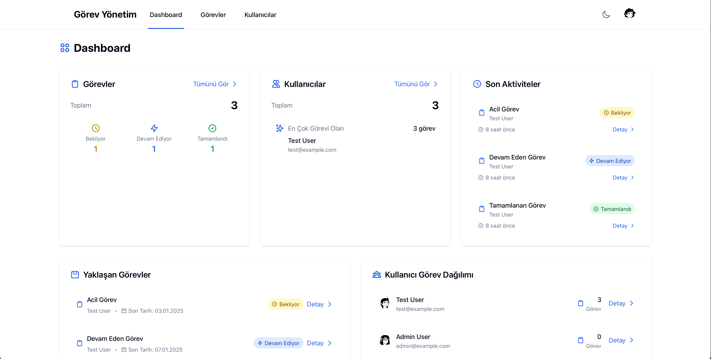
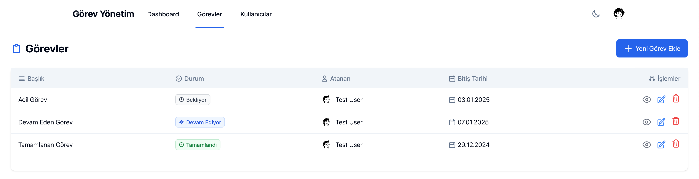
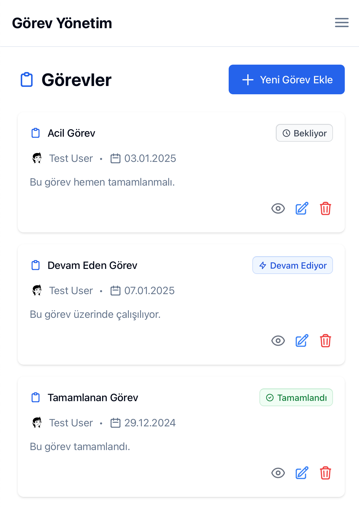
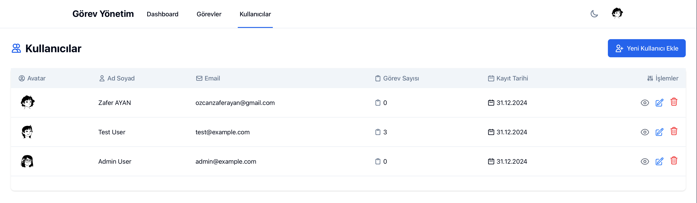

# Görev Yönetim Uygulaması

Modern ve kullanıcı dostu bir görev yönetim uygulaması. Laravel, Tailwind CSS ve Alpine.js kullanılarak geliştirilmiştir.

## Ekran Görüntüleri

### Dashboard



### Görevler



### Görevler (Mobil)



### Kullanıcılar



## Özellikler

-   🎨 Modern ve responsive tasarım
-   🌓 Karanlık/Aydınlık tema desteği
-   👥 Kullanıcı yönetimi
    -   Kullanıcı listesi
    -   Kullanıcı ekleme/düzenleme/silme
    -   Otomatik avatar oluşturma (Dicebear API)
-   ✅ Görev yönetimi
    -   Görev listesi
    -   Görev ekleme/düzenleme/silme
    -   Görev durumu takibi (Bekliyor, Devam Ediyor, Tamamlandı)
    -   Görevleri kullanıcılara atama
    -   Bitiş tarihi belirleme
-   📱 Mobil uyumlu arayüz
    -   Mobil menü
    -   Card görünümü
    -   Responsive tablolar

## Teknolojiler

-   **Backend:** Laravel 10
-   **Frontend:**
    -   Tailwind CSS
    -   Alpine.js
    -   Blade Templates
-   **Veritabanı:** MySQL
-   **API'ler:** Dicebear (Avatarlar için)

## Kurulum

1. Projeyi klonlayın:

```bash
git clone https://github.com/kullaniciadi/gorev_yonetim_tw.git
cd gorev_yonetim_tw
```

2. Bağımlılıkları yükleyin:

```bash
composer install
npm install
```

3. `.env` dosyasını oluşturun:

```bash
cp .env.example .env
```

4. Uygulama anahtarını oluşturun:

```bash
php artisan key:generate
```

5. Veritabanı ayarlarını yapın:
    - `.env` dosyasında veritabanı bilgilerinizi düzenleyin
    - Veritabanını oluşturun
    - Migrasyonları çalıştırın:

```bash
php artisan migrate --seed
```

6. Frontend varlıklarını derleyin:

```bash
npm run dev
```

7. Uygulamayı çalıştırın:

```bash
php artisan serve
```

## Kullanım

1. Tarayıcınızda `http://localhost:8000` adresine gidin
2. Varsayılan kullanıcı bilgileri:
    - Email: admin@example.com
    - Şifre: password

## Katkıda Bulunma

1. Bu repository'yi fork edin
2. Yeni bir branch oluşturun (`git checkout -b feature/amazing`)
3. Değişikliklerinizi commit edin (`git commit -m 'Harika özellik eklendi'`)
4. Branch'inizi push edin (`git push origin feature/amazing`)
5. Pull Request oluşturun

## Lisans

Bu proje MIT lisansı altında lisanslanmıştır. Daha fazla bilgi için `LICENSE` dosyasına bakın.
